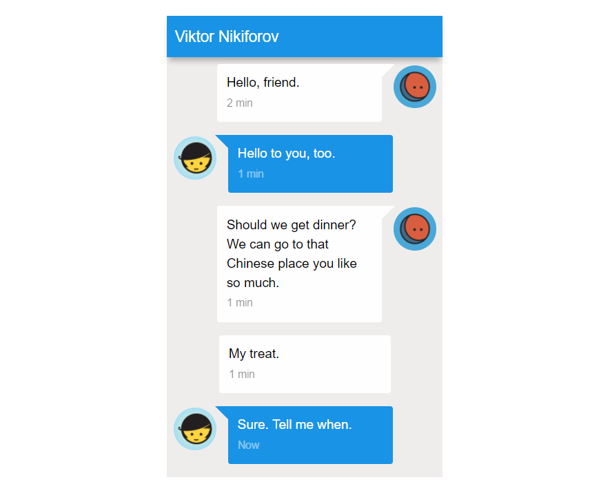
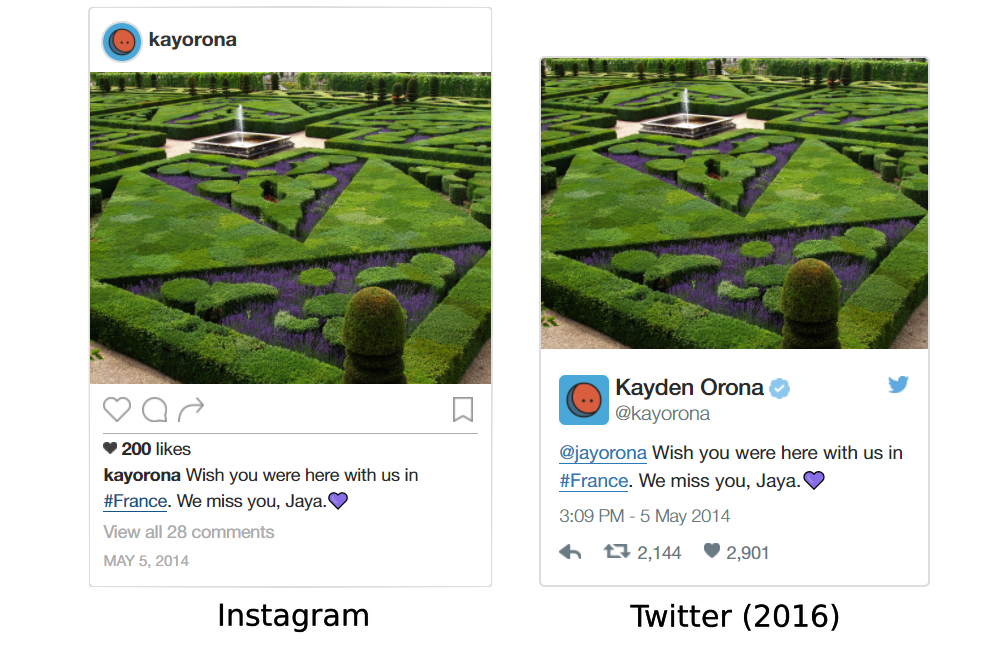
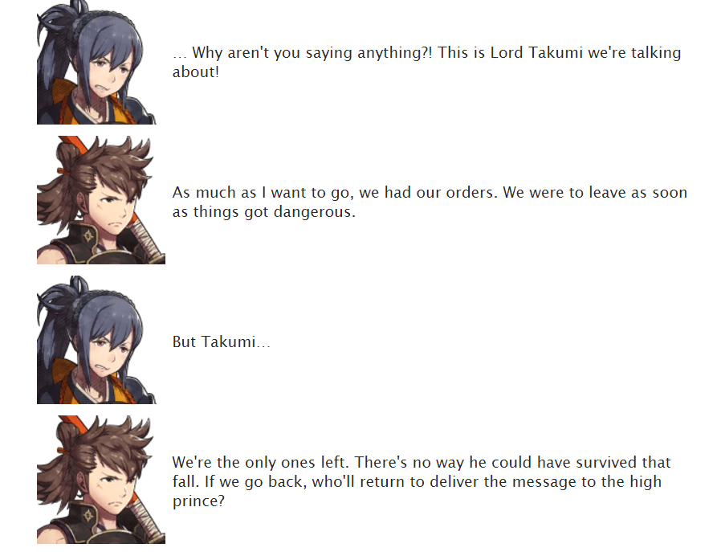

# AO3 Work Skins
THis is CSS code and HTML implementation for mock-ups of social media posts and other utilities for the Archive Of Our Own site. They allow users to customize and enhance their works. All CSS skins are intended to have responsive design for optimal viewing on both desktop and mobile devices. Documentation is provided as an example webpage and shared with the AO3 community. The following work skins are available in this repository.

Please note that these work skins were made primarily for the AO3 website exclusively. Word kerneling and margins may be shifted in the raw documentation compared to the actual results on the official site.

## Android Messaging 7.0

Want to make text messages for your story, but need an Android looking interface, not an iOS? Use the Android Messaging 7.0 work skin!

## Instagram and Twitter

Want to make high quality looking tweets your characters make in the story? Use the Twitter and Instagram mockups, complete with highlightable text and emoji support.

Note: The Twitter and Instagram formats were based off of designs as of January 2017.

## FE Scripting

Don't have time to write a full length story but still got ideas to make a script? Spruce your script fics up with this FE scripting!

